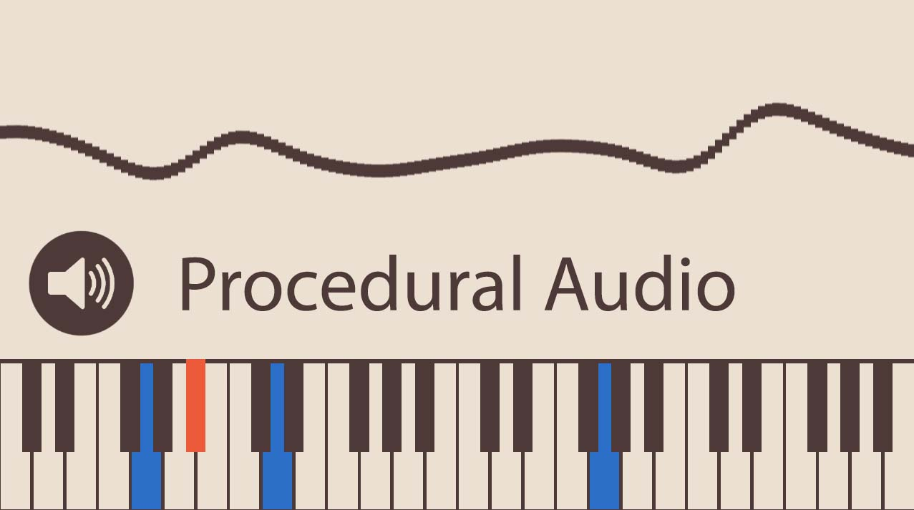

Realtime Procedural Audio and Synthesized Piano in Unity 3D
=================
This repo contains code for procedurally creating sounds for your game. The example I am using is a synthesized piano. You can read an indepth post here: [Realtime Procedural Audio and Synthesized Piano in Unity 3D](https://medium.com/@shahriyarshahrabi/realtime-procedural-audio-and-synthesized-piano-in-unity-3d-a98496a6df5e)

---------- 
To try out the program simply open the Concert Hall scene in the Scenes folder. When you press play you should here the piece Deck the Halls being played. You can adjust some settings on the Pianist class (attached as a component to the piano game object), such as tempo, and whether left or right hand (treble and bass) should play.
You can also play some notes on the keyboard for yourself. Which keys are mapped is listed in the Pianist class. 

There are a bunch of Test scenes and scripts. These are the simplified scripts doing very specific things. The piano class has all these functionalities in it. 

**Known Bug**: You might hear some noise the first time you play the scene after launching the editor. It will go away by the second time. 
